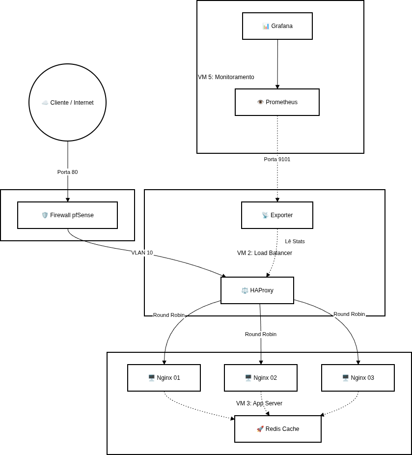

# Topologia da Infraestrutura

Este documento descreve a topologia lógica e física utilizada no projeto de
**Balanceamento de Carga com Alta Disponibilidade**.

## Visão Geral

A infraestrutura é composta por múltiplas máquinas virtuais (VMs) interligadas
em uma rede interna, simulando um ambiente real de produção.

---

## Descrição das Máquinas Virtuais

### VM 2 — Load Balancer
- Função: Balanceamento de carga e health check
- Tecnologias:
  - HAProxy
  - HAProxy Exporter
- IP: `10.0.10.10`
- Porta exposta:
  - HTTP: `80`
  - Métricas: `9101`

---

### VM 3 — Cluster de Aplicação
- Função: Hospedar a aplicação Web
- Tecnologias:
  - Docker
  - Nginx
  - Redis
- Containers:
  - `web1` → porta `8081`
  - `web2` → porta `8082`
  - `web3` → porta `8083`

---

### VM 5 — Monitoramento
- Função: Observabilidade e testes
- Tecnologias:
  - Prometheus
  - Grafana
  - Apache Benchmark (ab)
- Portas:
  - Grafana: `3000`

---

## Fluxo de Tráfego

1. O cliente envia requisições HTTP para o IP do HAProxy (`10.0.10.10`)
2. O HAProxy distribui as requisições usando algoritmo **Round Robin**
3. Os servidores web processam as requisições
4. As métricas são coletadas pelo Prometheus
5. O Grafana exibe a saúde e performance do sistema
